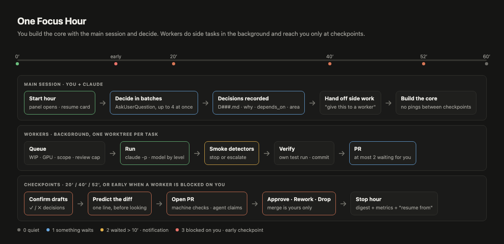
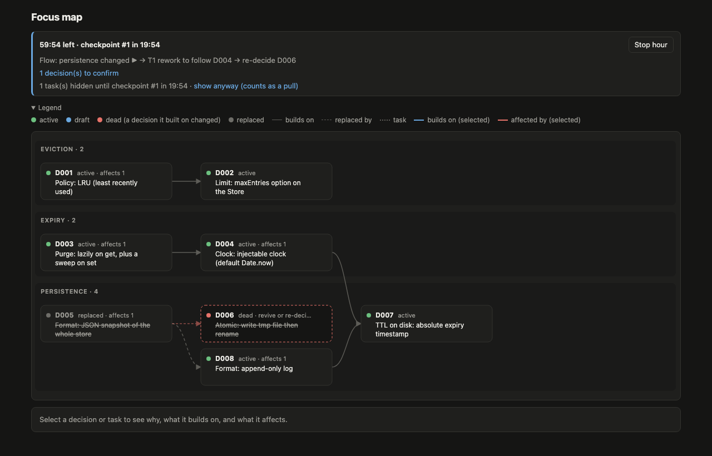
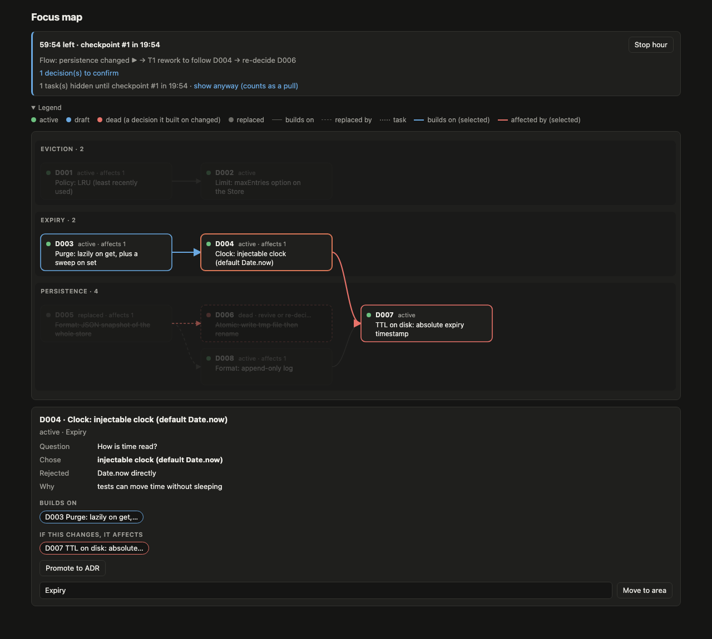
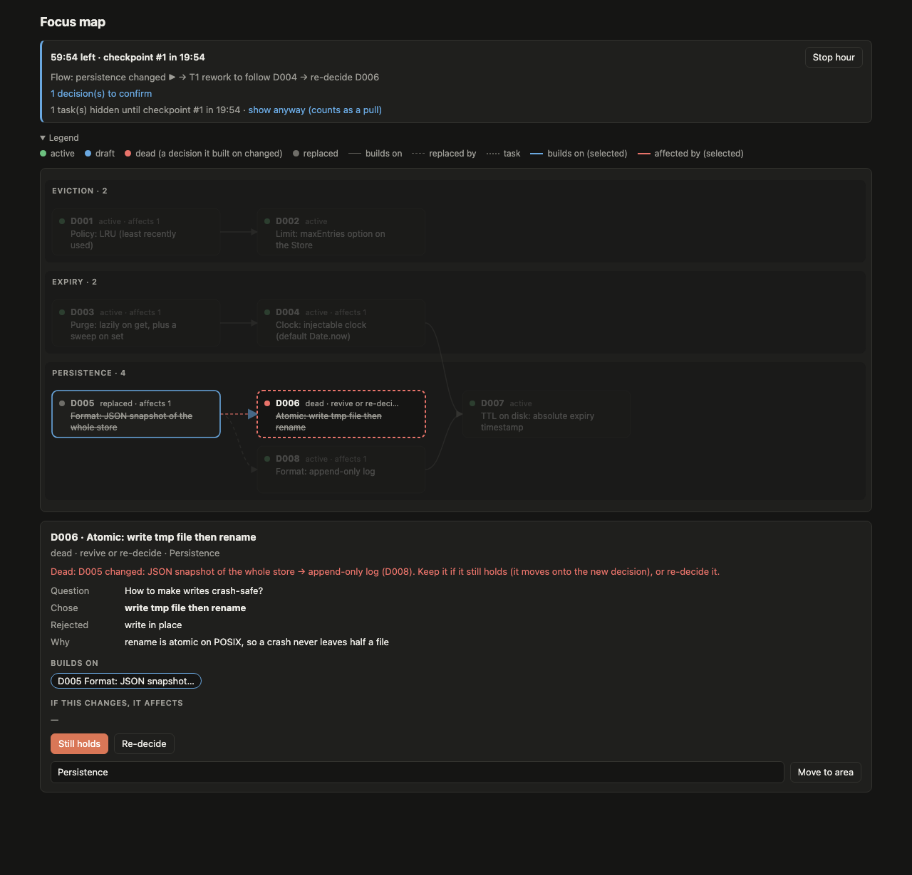
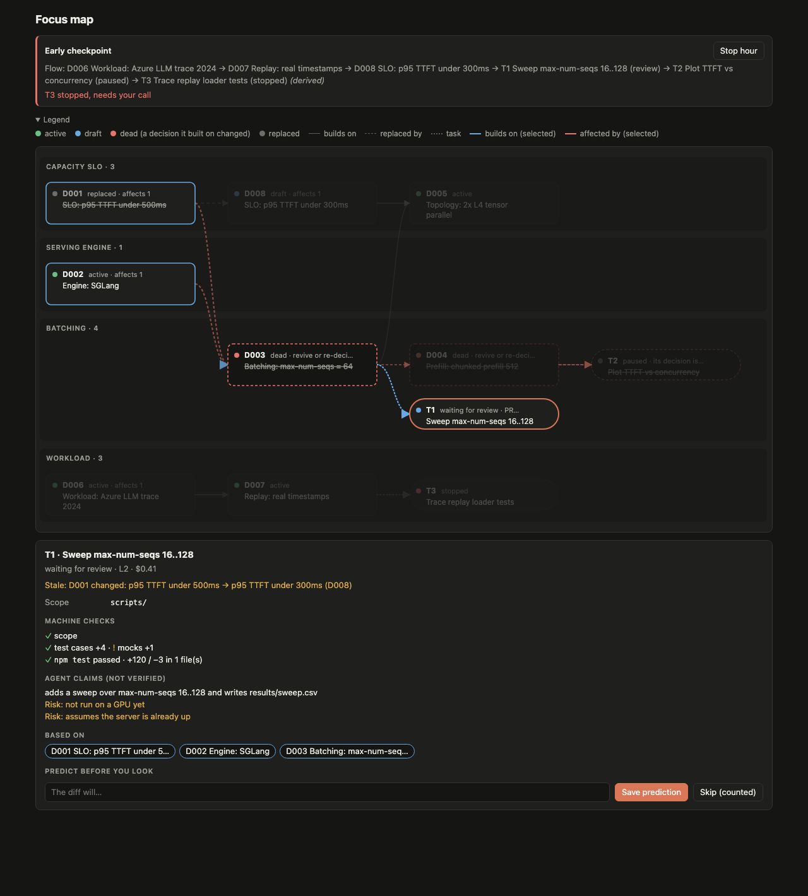
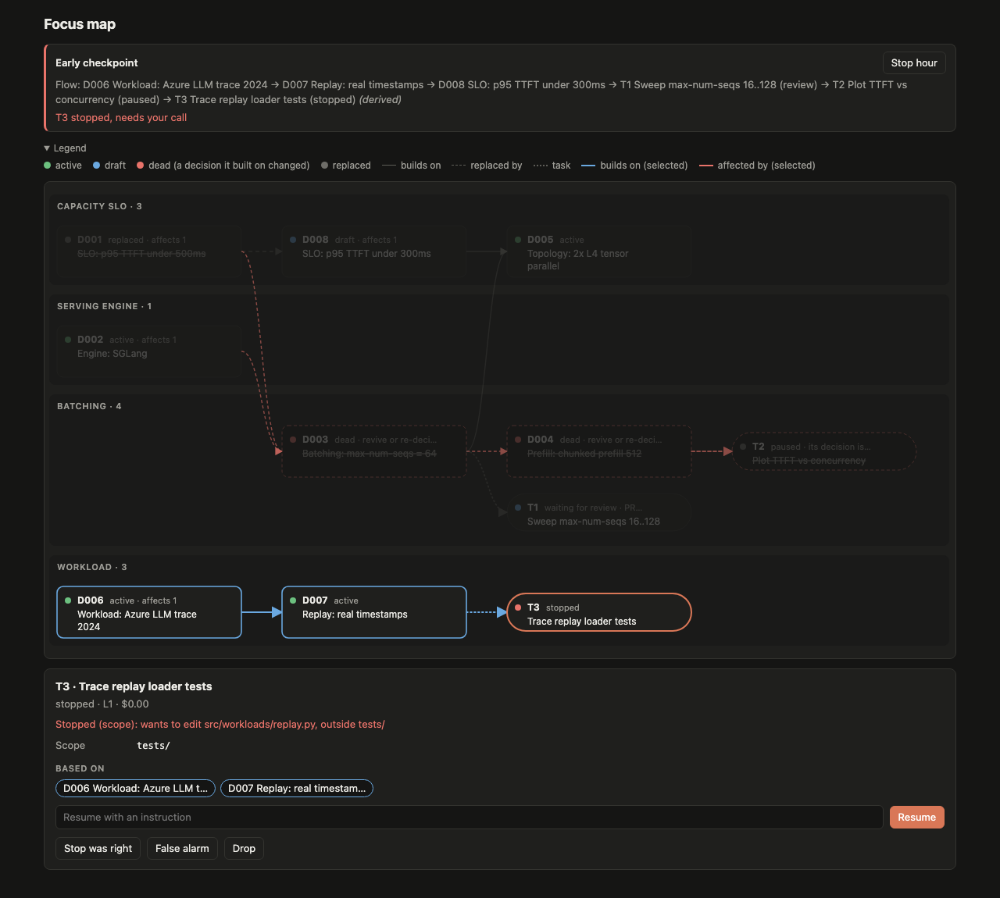
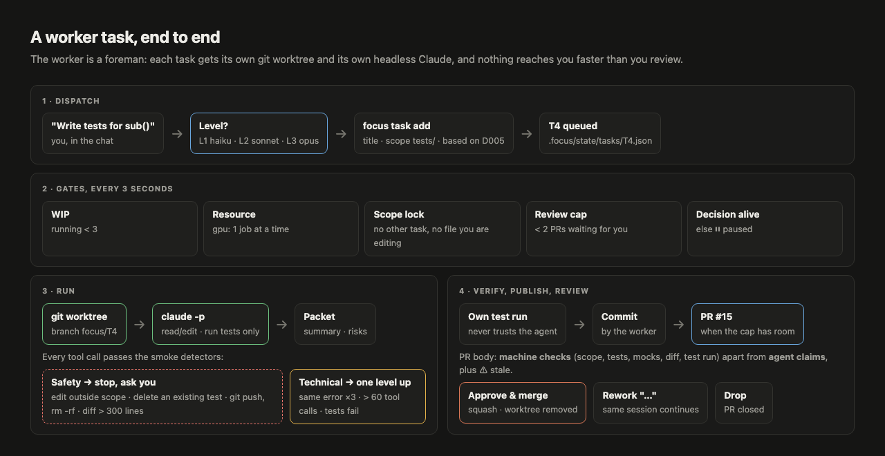
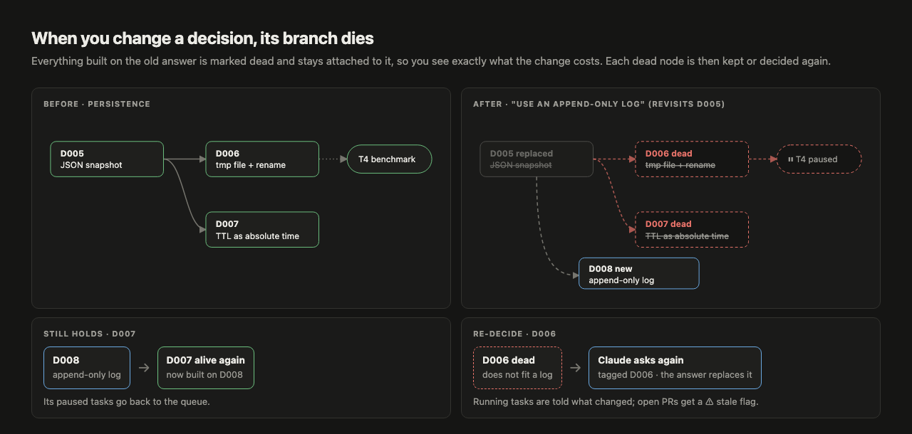

# Focus Hour

A Claude Code plugin for one focused hour with agents: you build the core with the main session and decide;
background workers do related side tasks in their own git worktrees and open PRs at your review pace; every decision
you make is recorded with a plain-language *why* and an impact graph. Design: [SPEC.md](SPEC.md) · Architecture (diagrams): [docs/ARCHITECTURE.md](docs/ARCHITECTURE.md).

## How it looks

**One Focus Hour**: you decide and build the core; workers reach you only at checkpoints.



**The Focus map**: decisions and tasks as a flow, one lane per feature area (docked in VS Code / Cursor).



| Select a decision: what it builds on (blue) and what it affects (red), across lanes | Change a decision: its branch dies until each node is kept or decided again |
|---|---|
|  |  |
| **Review a task**: machine checks apart from agent claims; predict before opening the PR | **A smoke detector stopped a worker**: resume it, label the stop, or drop it |
|  |  |

**A worker task, end to end** and **what a change of mind does**:




<sub>Sidebar and light theme: [06-sidebar.png](docs/images/06-sidebar.png) · [07-light.png](docs/images/07-light.png). Diagrams are generated from [docs/images/flows.html](docs/images/flows.html).</sub>

## Install (once per machine)

Needs Claude Code ≥ 2.1.288 (mods), Node ≥ 18, git; `gh` logged in for real PRs.

```bash
# 1. The Claude Code plugin (CLI, skills, mod)
claude plugin marketplace add hoangphu7122002/focus-hour
claude plugin install focus-hour@focus-hour

# 2. The Focus map panel for VS Code / Cursor (optional, recommended)
gh release download --repo hoangphu7122002/focus-hour --pattern '*.vsix'   # or take vscode/*.vsix from the repo
cursor --install-extension focus-hour-vscode-*.vsix                        # or: code --install-extension …

# 3. The `focus` command in your shell (optional): the installed plugin's CLI
alias focus='node "$(ls -d ~/.claude/plugins/cache/*/focus-hour/*/ | sort -V | tail -1)bin/focus.mjs"'
```

Restart Claude Code and the editor afterwards. Update later with `claude plugin update focus-hour@focus-hour`.

## Set up a repo (once per repo)

```bash
cd <repo> && focus init     # writes .focus/config.json (test command, base branch), gitignores .focus/state/
```

`focus init` also detects the stack's permission preset and prints `focus doctor` (what the repo still misses).
Edit `.focus/config.json` for anything that differs from the defaults (`focus defaults` prints them), e.g.
`"resources": { "gpu": 1 }`, `"language": { "chat": "vi" }`, `"roadmap": "docs/roadmap.md"`,
`"smokeCommand": "make demo"`, or `"slots"` for per-task ports/DBs.

**Scoped with bach-workflow?** Run `/bach:demo-scope`, then `focus init` in the repo: it picks up the roadmap, the
review lessons and `stack.toml`; build each feature with `/focus-plan <roadmap>#F<n>` instead of `/bach:pr-team`
(SPEC §7d).

**What belongs where.** The plugin holds code and generic rules; the repo holds only its own data
(`.focus/config.json`, `.focus/lessons.md`, `.focus/sessions/`, `docs/decisions/`, its roadmap). A rule for this repo
is a lesson (`focus lesson "[backend/] …"`); an idea for Focus Hour itself is `focus plugin-note "…"`, kept in
`~/.focus-hour/`, never in the repo. See [SPEC.md §3](SPEC.md#3-packaging).

## Each hour

Open the repo in VS Code / Cursor: the Focus map panel starts the dashboard and the workers. Without the editor,
run `focus ui` in a terminal (dashboard at http://127.0.0.1:7777 + workers), then `claude` in another.

| When | What |
|---|---|
| start | `/focus start` (or the pane's *Start hour*); `--observe` for a baseline session, `--difficulty 1-5` |
| deciding | ask for options; answers to AskUserQuestion become draft decisions (`/focus-grill` grills in batches) |
| side work | "give this to a worker" → `focus-task` skill → `focus task add …` |
| a feature | `/focus-plan docs/roadmap.md#F2` → tasks with order (`--after`); the next feature is offered when it merges |
| big PRs | opened as drafts; an opus reviewer clears them or sends blockers back; your GitHub comments become reworks |
| after merges | `smokeCommand` runs on main; `focus compare --repo a --repo b` for numbers |
| checkpoints | the pane opens; confirm drafts, review decisions marked ⚠, predict → open the PR → approve / rework / drop |
| end | `/focus stop` → `.focus/sessions/<date>-<n>.md` (digest + metrics); `focus report` compares focus vs observe |

**VS Code / Cursor panel.** With the extension installed, a *Focus Hour* icon in the activity bar opens the **Focus map** view. In a repo with
`.focus/config.json` it starts `focus ui` (dashboard + workers) by itself, mirrors the timer in the status bar, and
reveals the map at checkpoints. Settings: `focusHour.cliPath` (empty: the installed plugin), `focusHour.port`, `focusHour.autoStart`.

**Dashboard.** `focus ui` serves an Agent-map-style page at http://127.0.0.1:7777: open it in VS Code with
*Cmd+Shift+P → Simple Browser: Show* and dock it beside the chat (macOS notifications stand in for the pane's toasts).
In a terminal session, `/focus` opens the same view as a pane. Everything is also a CLI command: `focus help`.

## Develop

```bash
npm test                     # CLI unit tests + mod tests (claude plugin test)
claude plugin validate .
scripts/release.sh 0.3.0 "what changed"   # bump, test, commit, push, GitHub release, update local install
```
