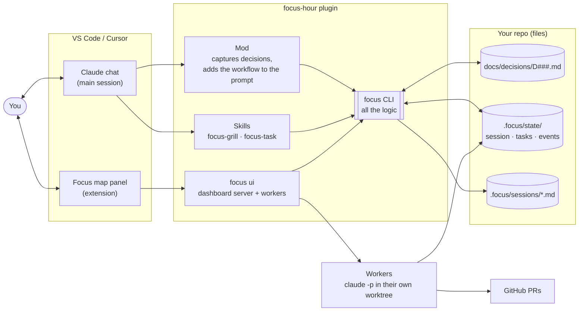
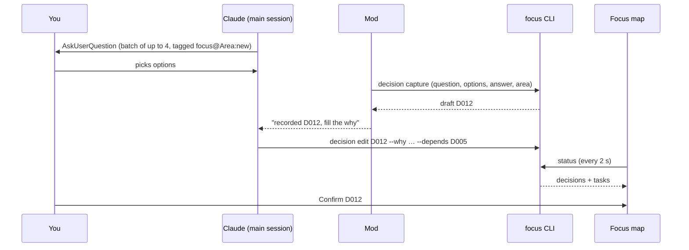
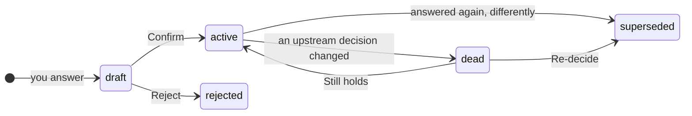
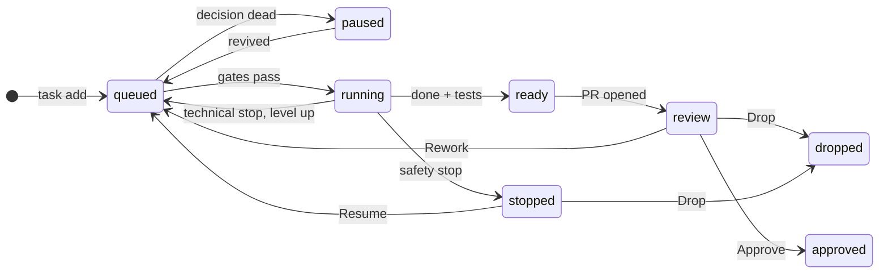
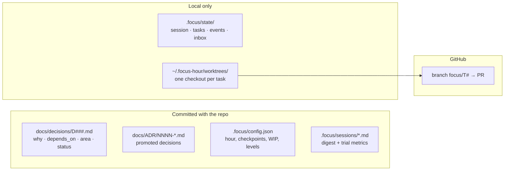

# Architecture

Focus Hour is three thin front ends over one CLI, and the CLI keeps everything as files in your repo.

## The pieces

- **Every change goes through the CLI**: the chat, the panel and the workers never write the files themselves.
- **The repo is the database**: decisions and digests are committed; `.focus/state/` is local and gitignored.

## A decision, from question to map

## A decision's life

"Still holds" re-attaches the decision to the new upstream one. An active decision that shapes the whole project can
be promoted to an ADR (`docs/ADR/`).

When a decision changes, everything that builds on it turns **dead**, its queued tasks **pause**, and running
tasks get a notice.

## A task's life

- **Gates**: fewer than 3 running, the GPU (or other resource) is free, no other task or open edit of yours touches
  the same files, and fewer than 2 PRs are waiting for you.
- **Safety stop**: an edit outside the task's scope, a deleted existing test, an irreversible command, a diff over 300
  lines. **Technical stop**: the same error 3 times, over 60 tool calls, failing tests; the task reruns one level up.

## Where the data lives

See [SPEC.md](../SPEC.md) for the full design and the reasoning behind each rule.
